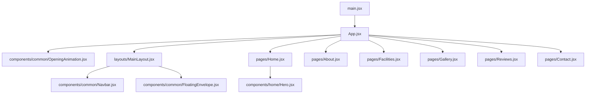

# Project Architecture - Ayswariya Mahal

This document summarizes the current React app structure and the main ownership boundaries.

## Directory Structure

```text
src/
├── assets/          # Static assets and images
├── components/      # Reusable React components
│   ├── common/      # Navbar, footer, opening animation, shared UI
│   └── home/        # Home-page sections
├── context/         # Shared React context providers
├── layouts/         # Page shell components
├── pages/           # Route-level page components
├── App.jsx          # Root app, routing, opening-animation gate
├── index.css        # Global Tailwind/theme styles
└── main.jsx         # React DOM entry point
```

## Dependency Graph



## Key Rules

- Routing is defined directly in `src/App.jsx`.
- The opening animation is app-level state, not a Home route effect, so internal navigation does not replay it.
- `EnquiryProvider` wraps the app once in `App.jsx`; layout components consume that context.
- Shared shell work belongs in `src/components/common/` and `src/layouts/MainLayout.jsx`.
- Home-only sections belong in `src/components/home/`.
