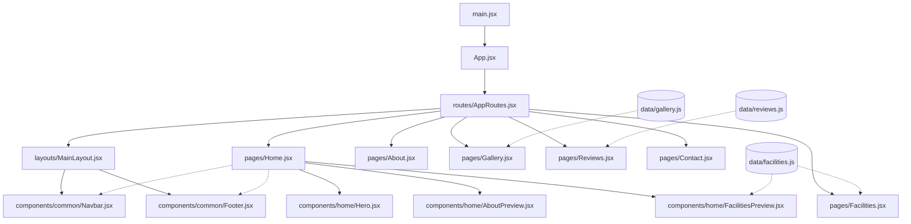

# Project Architecture - Ayswariya Mahal

This document maps out the project structure, dependency flow, component relationships, and provides a reference for codebase navigation to help reduce token usage when making major changes.

## 📁 Directory Structure

```text
src/
├── assets/          # Static assets (images, icons)
├── components/      # Reusable React components
│   ├── common/      # Global components (Navbar, Footer, SectionTitle)
│   └── home/        # Home-page specific components (Hero, Previews, CTA)
├── data/            # Mock data / static content (facilities, gallery, reviews)
├── layouts/         # Layout wrappers (MainLayout)
├── pages/           # Route-level page components
├── routes/          # Application routing (AppRoutes)
├── App.jsx          # Root component, sets up BrowserRouter
├── index.css        # Global styles (Tailwind)
└── main.jsx         # React DOM rendering entry point
```

## 🕸️ Dependency Graph


> [!WARNING]
> **Observation**: `pages/Home.jsx` imports and renders `Navbar` and `Footer` directly, but it is also wrapped in `MainLayout` inside `AppRoutes.jsx` (which already provides `Navbar` and `Footer`). This might result in duplicated headers and footers on the Home page.

## 🔗 Key Relationships & Rules
- **Routing**: Handled by `react-router-dom` in `AppRoutes.jsx`. All pages are wrapped in `MainLayout.jsx` by default.
- **Styling**: Tailwind CSS is used globally via `index.css`. Animations use GSAP (`gsap`) and Framer Motion (`framer-motion`).
- **Data Layer**: Content for Facilities, Gallery, and Reviews is decoupled into simple JS arrays in the `data/` folder, which act as the source of truth for both the full Pages and the Home Previews.
- **Common Components**: Shared UI elements (like `SectionTitle.jsx`) live in `components/common/`. 

## 🗺️ Codebase Navigation Guide
Before modifying features, follow this flow:
1. **Adding a Route**: Update `routes/AppRoutes.jsx` and create the new Page component in `pages/`.
2. **Modifying Content**: If it's a list (like facilities or photos), check `data/` first.
3. **Updating Layout**: Changes to the shell (Nav/Footer) should be done in `components/common/` and verified in `layouts/MainLayout.jsx`.
